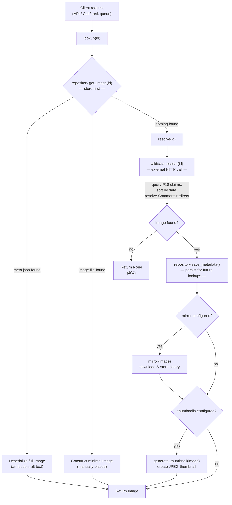

# Resolution flow

## Request flow

## Store as single source of truth

There is no separate cache layer. The store (`FTM_ASSETS_STORE_URI`) holds everything:

- `img/{id}/meta.json` — full `Image` model (attribution, alt text, URL)
- `img/{id}/{filename}` — mirrored image binary
- `img/{id}/thumbs/{size}.jpg` — generated thumbnail

On subsequent requests for the same ID, `lookup()` finds the metadata in the store
and returns immediately without calling Wikidata.

## Manual image placement

Images can be placed for any entity ID (not just Wikidata QIDs) via the `register` CLI command or by writing directly to the store. The `get_image()` function handles both cases:

1. **With metadata**: reads `meta.json` for full `Image` with attribution
2. **Without metadata**: scans for image files and constructs a minimal `Image`

## API reference

::: ftm_assets.logic
