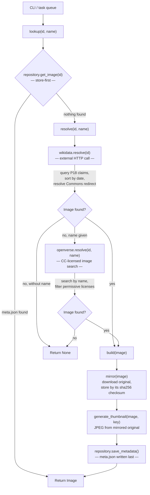

# Resolution flow

## Build flow

```mermaid
flowchart TD
    A["CLI / task queue"] --> B["lookup(id, name)"]
    B --> C{"repository.get_image(id)\n— store-first —"}

    C -->|meta.json found| DONE["Return Image"]
    C -->|nothing found| F["resolve(id, name)"]

    F --> G["wikidata.resolve(id)\n— external HTTP call —"]
    G -->|"query P18 claims,\nsort by date,\nresolve Commons redirect"| H{Image found?}

    H -->|yes| I["build(image)"]
    H -->|no, name given| OV["openverse.resolve(id, name)\n— CC-licensed image search —"]
    H -->|no, without name| NONE["Return None"]

    OV -->|"search by name,\nfilter permissive licenses"| OVH{Image found?}
    OVH -->|no| NONE
    OVH -->|yes| I

    I --> K["mirror(image)\ndownload original,\nstore by its sha256 checksum"]
    K --> M["generate_thumbnail(image, key)\nJPEG from mirrored original"]
    M --> N["repository.save_metadata()\n— meta.json written last —"]
    N --> DONE
```

## Store as single source of truth

The store (`FTM_ASSETS_STORE_URI`) holds everything and is meant to be served statically. Keys are relative to the store root, which can be any prefix (e.g. `s3://my-bucket/img`):

- `{id}/meta.json` — full `Image` model (attribution, alt text, relative urls)
- `{id}/{sha256}{ext}` — mirrored original image, by its sha256 checksum (with the file extension of its source)
- `{id}/thumbs/{size}.jpg` — generated thumbnail

`url` and `thumbnail_url` in `meta.json` are relative to its location, `original_url` is the source of the original image (see [`meta.json` fields](../usage.md#metajson)).

`meta.json` is written last, so its presence means the image is complete. If mirroring or thumbnail generation fails, no `meta.json` is written and the image is resolved again on the next lookup.

On subsequent lookups for the same ID, `lookup()` finds the metadata in the store and returns immediately without calling Wikidata.

## Errors

`ftm_assets.logic` raises on any failure, `None` only means that there is no image. Openverse is only searched if Wikidata answered without an image, a failed Wikidata request raises instead. A fallback image would stay in the store.

Requests that are rate limited or hit an unavailable server (status 429 or 503) are retried first, waiting for `Retry-After` if the server sends it, with an exponential backoff otherwise.

The CLI logs a failed image and continues with the next one. In the task queue the error fails the job.

## Python reference

::: ftm_assets.logic
